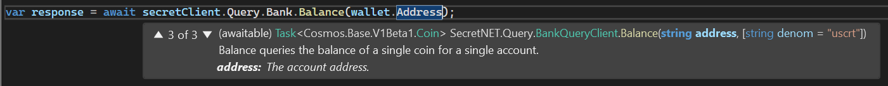

# Secret.NET Core Library
Secret.NET (port of the [secret.js](https://github.com/scrtlabs/secret.js) Client) is an .NET SDK for writing applications that interact with the [Secret Network blockchain](https://scrt.network/).

# Key Features
- Written in .NET 6 including MAUI Support.
- Can be used in MAUI Apps on Android, iOS, Windows and Mac.
- Provides simple abstractions over core data structures.
- Supports every possible message and transaction type.
- Exposes every possible query type.
- Handles input/output encryption/decryption for Secret Contracts.
- The SDK has a wallet built in and does not currently require / support external wallets.
- Custom APIs / clients for specific smart contracts can be easily created (see packages for tokens / SNIP20 or NFT / SNIP721).

:information_source: This library is still in beta (as [secret.js](https://github.com/scrtlabs/secret.js)), APIs may break. Beta testers are welcome!

## Additional packages
In addition to the Secret.NET Core Library, the following complementary packages are available:
- [**Full SNIP-20 (Token) client**](https://github.com/0xxCodemonkey/SecretNET.SNIP20), which exposes all methods of the [SNIP-20 reference implementation](https://github.com/scrtlabs/snip20-reference-impl).
- [**Full SNIP-721 / SNIP-722 (NFT) client**](https://github.com/0xxCodemonkey/SecretNET.SNIP721), which exposes all methods of the [SNIP-721 reference implementation](https://github.com/baedrik/snip721-reference-impl).
- **UI Package** (coming soon), which contains typical MAUI controls such as Confirm Transaction, Wallet Setup, Scan Keplr QR, etc. 

## Full API-documentation
You can find the **full API-documentation** here => [https://0xxcodemonkey.github.io/SecretNET](https://0xxcodemonkey.github.io/SecretNET/html/T-SecretNET.SecretNetworkClient.htm)

# Table of Contents
- [Key Features](#key-features)
  - [Additional packages](#additional-packages)
  - [Full API-documentation](#full-api-documentation)
- [Table of Contents](#table-of-contents)
- [General information](#general-information)
- [Usage](#usage)
  - [Installation](#installation)
    - [Additional packages](#additional-packages)
- [Examples](#examples)
   - [Creating / Initializing the Wallet](#creating--initializing-the-wallet)
      - [Importing account from mnemonic phrase](#importing-account-from-mnemonic-phrase)
      - [Importing private key](#importing-private-key)
      - [Use previously saved wallet](#use-previously-saved-wallet)
      - [Import via Keplr QR](#import-via-keplr-qr)
      - [Generating a new account](#generating-a-new-account)
      - [Attaching the wallet to the SecretNetworkClient (required for signing transactions)](#attaching-the-wallet-to-the-secretnetworkclient-required-for-signing-transactions)
  - [Sending Queries](#sending-queries)
  - [Broadcasting Transactions](#broadcasting-transactions)
  - [Uploading and initialize Smart Contract](#uploading-and-initialize-smart-contract)
  - [Calling a Smart Contract](#calling-a-smart-contract)
  - [Interacting with an Token Contract (SNIP20)](#interacting-with-an-token-contract-snip20)
  - [Interacting with an NFT Contract (SNIP721)](#interacting-with-an-nft-contract-snip721)
- [SecretNetworkClient](#secretnetworkclient)
  - [Querier](#querier)
  - [Transactions](#transactions)

# General information
The rough structure of the Secret.NET client, from the user's perspective, is divided into the following areas:
- **Queries** (accessible via ```Query``` property), to get informations from the blockchain or an smart contract.
- **Transactions** (accessible via ```Tx``` property), to interact activly with the blockchain e.g. sending funds or calling smart contract methods.
- **Permits** (accessible via ```Permit``` property) for requesting protected informations in a query, without the need for a separate transaction.

**Queries** cost no fees, are executed "immediately" and do not require a wallet.

**Transactions** are broadcast to the blockchain in encrypted form and have to be processed. Therefore, they cost fees and the messages must be signed by the sender and a wallet is required for signing the transactions.

All transactions can also be simulated via ``Tx.Simulate`` to determine the estimated fees.

**Permits** can be signed with the ```Permit.Sign``` method.

**All types and methods are documented and eases programming:**



# Usage 
## Installation
The Secret.NET Core Libray can be easily installed via Nuget: 

``` nuget.exe ``` -CLI:
``` bash 
nuget install SecretNET
```
[NuGet-Paket-Manager-Konsole](https://docs.microsoft.com/de-de/nuget/consume-packages/install-use-packages-powershell):
```  bash
Install-Package SecretNET
```

## Additional packages
nuget.exe-CLI:
```  bash
nuget install SecretNET.SNIP20
nuget install SecretNET.SNIP721
nuget install SecretNET.UI (coming soon)
```

NuGet-Paket-Manager-Konsole:
```  bash
Install-Package SecretNET.SNIP20
Install-Package SecretNET.SNIP721
Install-Package SecretNET.UI (coming soon)
```
# Examples
## Creating / Initializing the wallet
When initializing a wallet, you must pass an *IPrivateKeyStorage* provider where the private key and mnemonic phrase will be stored (default = MauiSecureStorage). 
The following providers are available out of the box:

- **MauiSecureStorage**
Utilized the [Microsoft.Maui.Storage.SecureStorage](https://docs.microsoft.com/en-us/dotnet/maui/platform-integration/storage/secure-storage) to securely save data (can only be used in MAUI apps).
- **AesEncryptedFileStorage**
AesEncryptedFileStorage encryptes data to the local file system (not recommended in MAUI Apps since password is stored in memory).
- **InMemoryOnlyStorage**
Stores the data ONLY (unencrypted!) in memory.

The .NET MAUI SecureStorage uses the OS capabilities as follows to store the data securely:

| Plattform | Info |
| ------------- | -------------  |
| Android | Data is encrypted with the Android EncryptedSharedPreference Class, and the secure storage value is encrypted with AES-256 GCM. |
| iOS / macOS | The iOS Keychain is used to store values securely. | 
| Windows | DataProtectionProvider is used to encrypt values securely on Windows devices. | 

:warning: **Never store the private key or mnemonic phrase permanent in a variable (or somewhere else than in a secure storage) or output them in a log!**
**Only store them in a secure storage like the default implementation.**

### Importing account from mnemonic phrase
Simply use the mnemonic phrase in the ```Wallet.Create``` method (and use the wallet in the constructor of the SecretNetworkClient:) like this

```  csharp
var walletFromMnemonic = await SecretNET.Wallet.Create("detect unique diary skate horse hockey gain naive approve rabbit act lift");
```
### Importing private key
Simply use the private key in the ```Wallet.Create``` method (and use the wallet in the constructor of the SecretNetworkClient) like this:
```  csharp
var walletFromSeed = await SecretNET.Wallet.Create(** byte[] private key **);
```

### Use previously saved wallet

```csharp
var secureLocalStorageProvider = new MauiSecureStorage();
var securewalletOptions = new SecretNET.Common.CreateWalletOptions(secureLocalStorageProvider);

Wallet secureWallet = null;
if (await secureLocalStorageProvider.HasPrivateKey())
{
    var storedMnemonic = await secureLocalStorageProvider.GetFirstMnemonic();
    secureWallet = await SecretNET.Wallet.Create(storedMnemonic, options: securewalletOptions);
}
```

### Import via Keplr QR
- coming soon...
### Generating a new account
To generate a complete new random wallet just use the ```Wallet.Create``` method without a parameter (default wordlist is english), or specify another Wordlist (also supported: chinese_simplified, chinese_traditional, japanese, spanish, french, portuguese_brazil and czech).
```  csharp
var newRandomWallet = await SecretNET.Wallet.Create(Wordlist.English);
```
### Attaching the wallet to the SecretNetworkClient (required for signing transactions)
In the constructor:
```  csharp
var secretNetworkClient = new SecretNetworkClient("https://pulsar-2.api.trivium.network:9091", "pulsar-2", wallet);
```
Later via prop:
```  csharp
secretNetworkClient.Wallet = walletFromMnemonic;
```
## Sending Queries
### `secretClient.Query`

#### `secretClient.Query.GetTx(string hash, bool tryToDecrypt = true)`
Returns a transaction with a txhash. `hash` is a 64 character upper-case hex string.

If set the parameter tryToDecrypt to true (default) the client tries to decrypt the tx data (works only if the tx was created in the same session / client instance or if the same CreateClientOptions.EncryptionSeed is used).

#### `secretClient.Query.TxsQuery(string query, bool tryToDecrypt = false)`
Returns all transactions that match a query.

If set the parameter tryToDecrypt to true (default = false) the client tries to decrypt the tx data (works only if the tx was created in the same session / client instance or if the same CreateClientOptions.EncryptionSeed is used).

To tell which events you want, you need to provide a query. query is a string, which has a form: `condition AND condition ...` (no OR at the moment). Condition has a form: `key operation operand`. key is a string with a restricted set of possible symbols (`\t`, `\n`, `\r`, `\`, `(`, `)`, `"`, `'`, `=`, `>`, `<` are not allowed). Operation can be `=`, `<`, `<=`, `>`, `>=`, `CONTAINS` AND `EXISTS`. Operand can be a string (escaped with single quotes), number, date or time.

Examples:

- `tx.hash = 'XYZ'` # single transaction
- `tx.height = 5` # all txs of the fifth block
- `create_validator.validator = 'ABC'` # tx where validator ABC was created

Tendermint provides a few predefined keys: `tx.hash` and `tx.height`. You can provide additional event keys that were emitted during the transaction. All events are indexed by a composite key of the form `{eventType}.{evenAttrKey}`. Multiple event types with duplicate keys are allowed and are meant to categorize unique and distinct events.

To create a query for txs where AddrA transferred funds: `transfer.sender = 'AddrA'`

See `txsQuery` under https://0xxcodemonkey.github.io/SecretNET/html/AllMembers.T-SecretNET.Query.Queries.htm

### Get SCRT Balance

```csharp
var response = await secretClient.Query.Bank.Balance("secret1ap26qrlp8mcq2pg6r47w43l0y8zkqm8a450s03");
Console.WriteLine("Balance: " + (float.Parse(response.Amount) / 1000000f)); // denom: "uscrt"
```

### Query smart contract (permissionless method)

```csharp
// grpcWebUrl => TODO get from https://github.com/scrtlabs/api-registry
// chainId e.g. "secret-4" or "pulsar-2"
var secretClient = new SecretNetworkClient(grpcWebUrl, chainId, wallet: null);

// https://github.com/scrtlabs/mysimplecounter
var contractAddress = "secret12j8e6aeyy9ff7drfks3knxva0pxj847fle8zsf"; // pulsar-2
var contractCodeHash = "3d528d0d9889d5887abd3e497243ed6e5a4da008091e20ee420eca39874209ad";

var getCountQueryMsg = new { get_count = new { } };

var queryContractResult = await secretClient.Query.Compute.QueryContract<object>(
				contractAddress: contractAddress, 
				queryMsg: getCountQueryMsg, 
				codeHash: contractCodeHash); // optional but way faster

Console.WriteLine(queryContractResult.Response); // JSON string
```

Or even easier for a **SNIP20 Contract** via **SecretNET.SNIP20** Add-On:

```csharp
var snip20Client =  new SecretNET.SNIP20.Snip20Client(secretClient);

var sSCRT_Address = "secret1k0jntykt7e4g3y88ltc60czgjuqdy4c9e8fzek"; // secret-4
var sScrt_CodeHash = "af74387e276be8874f07bec3a87023ee49b0e7ebe08178c49d0a49c3c98ed60e";

var tokenInfoResult = (await snip20Client.Query.GetTokenInfo(
					contractAddress: sSCRT_Address, 
					codeHash:  sScrt_CodeHash // optional but way faster
          )).Response.Result;

Console.WriteLine($"TokenName: {tokenInfoResult.Name}, Symbol: {tokenInfoResult.Symbol}");
```
#### Other queries eg. account, auth, bank, etc.
##### secretClient.Query.Auth
- `Account(string address)` => Returns account details based on address.
- `Accounts()` => Returns all existing accounts on the blockchain.

## Broadcasting Transactions
## Uploading and initialize Smart Contract
## Calling a Smart Contract
## Interacting with an Token Contract (SNIP20)
## Interacting with an NFT Contract (SNIP721)
# SecretNetworkClient
[**Full API »**](https://0xxcodemonkey.github.io/SecretNET/html/T-SecretNET.SecretNetworkClient.htm)

## Querier
The querier can only send queries and get chain information. Access to all query types can be done via ```SecretNetworkClient.Query```.

## Transactions
Use ```SecretNetworkClient.Tx``` to broadcast transactions.
